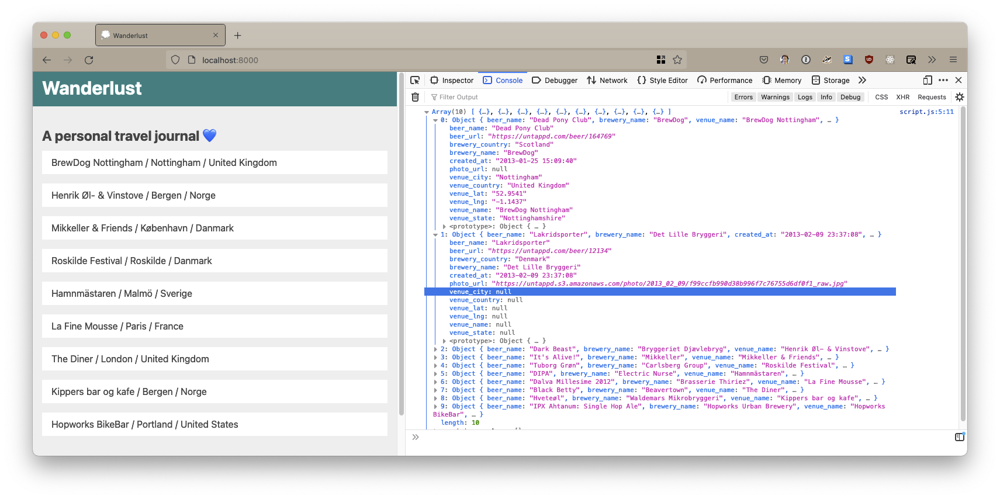
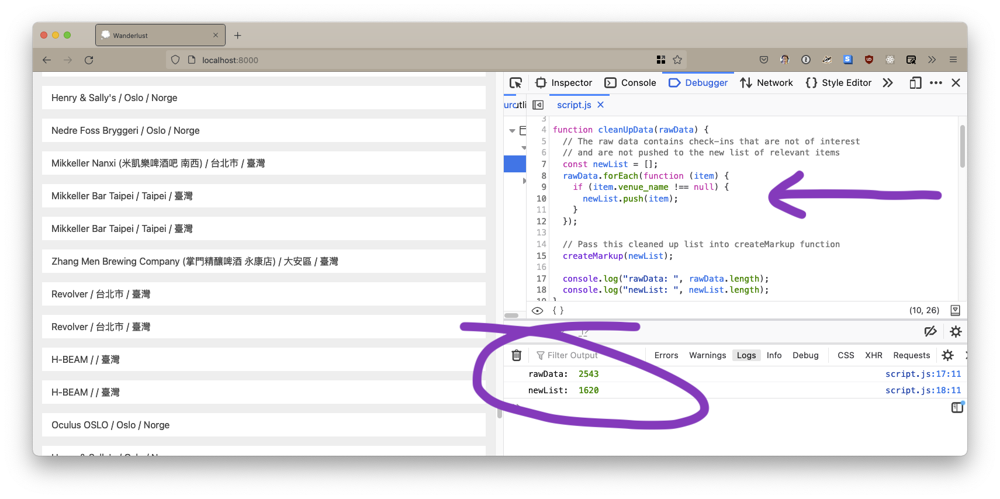
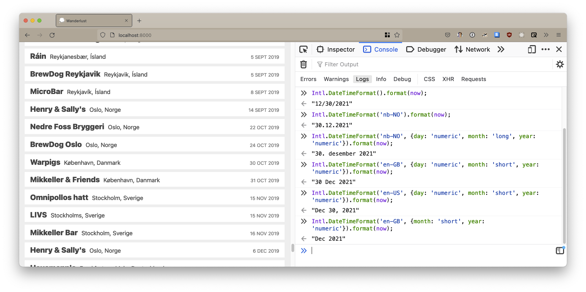
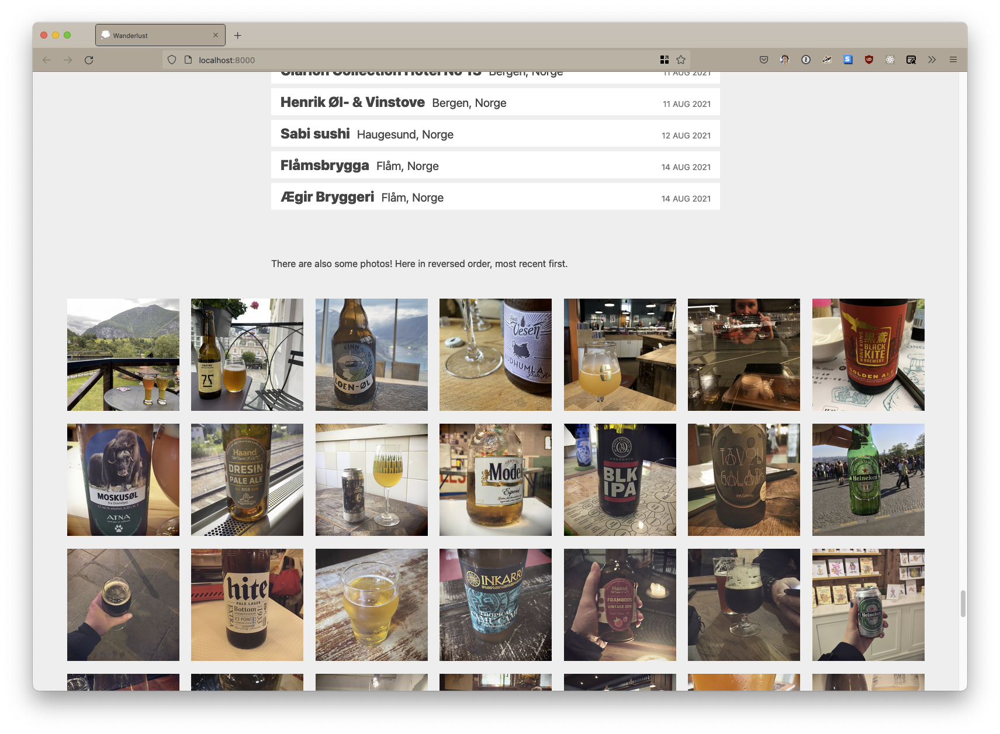

# Wanderlust

A personal travel journal — using JavaScript and 9 years of data from my Untappd account — to stroll down memory lane of past trips.

> The term originates from the German words wandern ('to hike') and Lust ('desire'), literally translated as 'enjoyment of hiking', although it is commonly described as 'enjoyment of strolling, roaming about, or wandering'. In modern German, the use of the word Wanderlust to mean 'desire to travel' is less common, having been replaced by Fernweh (lit. 'far-sickness'), coined as an antonym to Heimweh ("homesickness").

## CS50 Final Project

Once upon a time, back in the days of a pre-pandemic world, I had the privilege of enjoying a lot of travel. My idea for [CS50 Final Project](https://cs50.harvard.edu/x/2021/project/) is to leverage my interest in traveling — and in this way make sure that I really do “create something that outlives this course” — because this is likely something I will continue to work on also after submitting this project.

I have registered beers on Untappd since 2013. I do like beer, but most of all, this application just happens to also be a rich source of data on where in the world I have been the past decade.

The main feature of the official Untappd service is a feed of what your friends are drinking. In addition to that, if you have a paid account, you can also access personal statistics. But those are focused on beers and breweries, which badges you have earned, your highest rated beers, and most frequently visited venues. I can for example see a list of top 5 countries, but those are country of origin for beers I have had — not countries where I have checked in. The content I am looking is different from what the official application (and their business model) revolve around. I want to figure out how to present different data — for me personally — focusing less on the beers and more on places I have visited.

---

## Researching the API 🕵🏻‍♀️

- Public Untappd API: [untappd.com/api/docs](https://untappd.com/api/docs)
- Untappd For Business: [docs.business.untappd.com](https://docs.business.untappd.com/)

Venues and breweries might be interested in [Untappd for Business](https://utfb.untappd.com/) but the public API is for developers like me, though you do have to apply for access. My application has been approved, and I have a personal API key consisting of Client ID and Client Secret. **Which endpoints will I be interested in?**

### User Activity Feed

- HTTP Method: `GET`
- Endpoint: `/v4/user/checkins/USERNAME`
- [untappd.com/api/docs#useractivityfeed](https://untappd.com/api/docs#useractivityfeed)

This gets me my check-in feed, which sounds exactly what I am looking for. What I don’t quite understand yet, is the `limit` parameter. The default is 25, but is 25 also the maximum number of check-ins I get from this endpoint? That’s no good when I want to access ~2500 check-ins 😅

```
https://api.untappd.com/v4/method_name?client_id=CLIENTID&client_secret=CLIENTSECRET
```

Okay we really should read up on [REST APIs](https://idratherbewriting.com/learnapidoc/) and figure out how to poke about responses in a browser. I can see now where the credentials go, and then where to insert the endpoint for user activity. I can add `&limit=5` to use the limit parameter, and playing around with it I soon discover that while 25 is not the maximum, I never get more than 50. That’s a hurdle, but I don’t yet see if it is a show stopper or not.

### Venue Info

- HTTP Method: `GET`
- Endpoint: `/v4/venue/info/VENUE_ID`
- [untappd.com/api/docs#venueinfo](https://untappd.com/api/docs#venueinfo)

There is also a `compact` parameter to remove recent check-ins, top beers +++ which sounds useful for my purposes. Example response excerpt:

```json
{
  "venue": {
    "venue_id": 182152,
    "venue_name": "BrewDog Nottingham"
    "location": {
      "venue_city": "Nottingham",
      "venue_country": "United Kingdom",
      "lat": 52.9541092,
      "lng": -1.1436979
    },
}
```

### Perhaps I don’t actually need API calls?! 🤯

I remember from previous years of having a paid account, that one of the perks is **exporting data**. Let’s see what data we get access to then. Oh my… okay. So how I understand it after studying my export:

The way these APIs are designed — my best approach to get the data for a personal travel journal is to skip the API — and instead export my data as `csv` or `json`. Current conclusion is that I don't need the API for any of the most important things I want to do, but I can definitly hang on to the opportunity as an add-on later. Perhaps something like making a request for additional [Beer Info](https://untappd.com/api/docs#beerinfo) or [Brewery Info](https://untappd.com/api/docs#breweryinfo)?!

## Export Data

My first thought was that the export could get me past the limit in the API, then I could call the API to get additional info. But I see now that the export already has _everything_ I am interested in, all the venue info and even `photo_url`. Each check-in comes with over 30 data points, here is an example excerpt of the most relevant:

```json
[
  {
    "beer_name": "Svartediket Black IPA",
    "brewery_name": "7 Fjell Bryggeri",
    "venue_name": "Apollon Platebar",
    "venue_city": "Bergen",
    "venue_country": "Norge",
    "venue_lat": "60.3897",
    "venue_lng": "5.32309",
    "created_at": "2015-01-31 21:36:51",
    "photo_url": null
  }
]
```

### CSV or JSON?

How does it makes sense to work with this data set? Do I want to… 🤔 import it into a database? Perhaps that would make a project more maintainable or whatever, but for right now, I am good with using the raw data export. I want to focus on getting it into a browser. CSV or JSON? There’s not a complex nested hierarchy in this data set, there is one list with a single level of key/value pairs for each item. CSV can be read row by row, but since I will be working with JavaScript, opting for JSON is surely more native. Does the file size matter?

- When I export my data as JSON it weighs in 2.7MB
- and the same export as a CSV file is 841KB

I have seen `package-lock.json` files larger that this, so let’s roll with JSON.

### Run a local server

```bash
python -m SimpleHTTPServer
```

### Fetch API

I started with `XMLHttpRequest` based on reading [MDN’s Working with JSON](https://developer.mozilla.org/en-US/docs/Learn/JavaScript/Objects/JSON) — but after a while landed on the [Fetch API](https://developer.mozilla.org/en-US/docs/Web/API/Fetch_API) as a newer approach.

## The DOM is alive with data 🎉



My program can now render data from the JSON file, and I have a function that will remove check-ins without a venue, that are not of interest for this travel journal.

### But I have a bug to fix

The approach with using a `forEach()` method works nicely on my tiny limited data set in [test-data.json](https://github.com/elisabethirgens/wanderlust/blob/main/test-data.json) but breaks when I change the file to the full raw data export. The page now gets a lot of `null` entries and I have clearly hit some kind of limitation, but no idea which limit. When I `console.log(rawData)` and `console.log(newList)` there is a difference in length: **2543 vs 1783 items**. I can see that some check-ins without a venue are removed, but many are not. It’s like the function just can’t quite keep up…? But I’m confused by how the diff in length is completely consistent.

Copying the original array, and then using `splice()` to remove felt weird. Now I want to see what happens if I flip it around. Start with an empty array, check for venue, then use `pop()` to add items. Even if I meet a similar limitation, this will be more robust. An incomplete new list is an improvement over a list that contains empty venues. The most important feature of my app right now is getting an awesome list of places. And yay, the function now creates a list of **1620 items** without rendering any `null` venue check-ins to the DOM.



## Dates? Times? DateTime! 📆

A journal needs dates, right? And there are many ways to overcomplicate this. Did anyone mention… time zones?! But simple does the trick. JSON has no concept of dates, the value is a string of numbers, dashes and colons.

```
"created_at": "2013-01-25 15:09:40"
"created_at": "2014-07-23 12:24:26"
"created_at": "2021-08-14 21:39:39"
```

JavaScript has [Date](https://developer.mozilla.org/en-US/docs/Web/JavaScript/Reference/Global_Objects/Date) as a standard built-in object.

> Date objects contain a Number that represents milliseconds since 1 January 1970 UTC.

```js
// Turn JSON string into an actual Date object
item.created_at = new Date(Date.parse(item.created_at));
```

Next I can use [Intl.DateTimeFormat](https://developer.mozilla.org/en-US/docs/Web/JavaScript/Reference/Global_Objects/Intl/DateTimeFormat) for date and time formatting that even speaks Norwegian if I want.

```js
// Format date to something readable
var formattedDate = Intl.DateTimeFormat("en-GB", {
  day: "numeric",
  month: "short",
  year: "numeric",
}).format(item.created_at);
```



## City as home vs travel destination

After removing entries without location and repeat check-ins at the same venue same day, I am left with **871 items** in the list. Still too much noise. Many are from Bergen when I lived there, and then from Oslo where I live now. For a proper travel journal, I need some logic to only flag as `interesting` the check-ins from cities that I did not live in, but only at that time. I don’t want to remove entries from both cities all together, because both Bergen and Oslo have also been requent travel destinations for me. Thankfully I have only moved once in these 9 years, and figured out how to end with **346 items** in my list:

```js
// Skip any items from cities that I lived in at that time
const movedToOslo = new Date("2015-08-31");
if (
  item.created_at.getTime() < movedToOslo.getTime() &&
  item.venue_city === "Bergen"
) {
  interesting = false;
}
if (
  item.created_at.getTime() > movedToOslo.getTime() &&
  item.venue_city === "Oslo"
) {
  interesting = false;
}
```

## The journal also has photos 📸

Some check-ins also have a `photo_url` directly to Untappd that I can reference inside an ``. Since most of the entries _don’t_ have a photo though, I decided against trying to present them in direct connection to the list. But a separate gallery at the bottom of the page looks pretty cool!



## Roadmap 🚀

There are so many things I want to keep working on with this project! It would be fun to look into:

- Handle markup with something like Eleventy (11ty)
- Publish the site
- Create a database
- Review and refactor the JavaScript
- …add more features!

### Countries WIP

The JSON export contains 16 different countries and several are in local languages, which is cool but also difficult for me to read in some cases. Current WIP is mapping the countries and also adding a flag.

```js
const countries = [
  {
    org: "Sverige",
    eng: "Sweden",
    flag: "🇸🇪",
  },
  {
    org: "臺灣",
    eng: "Taiwan",
    flag: "🇹🇼",
  },
  {
    org: "ประเทศไทย",
    eng: "Thailand",
    flag: "🇹🇭",
  },
];
```
